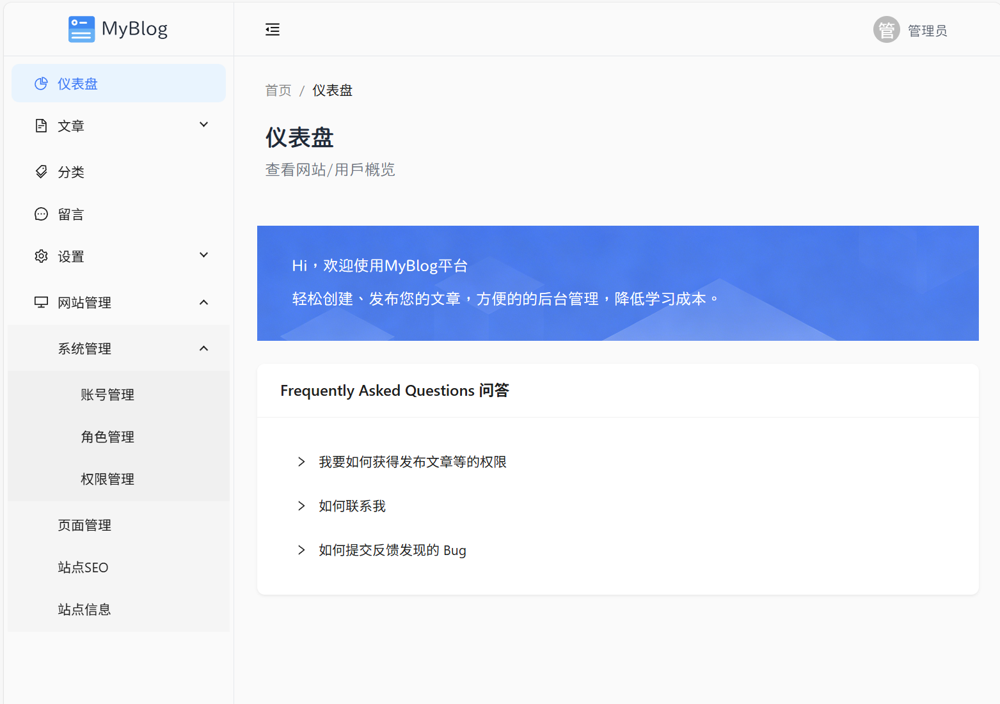

# MyBLOG 后台项目结构文档

## 部署改项目：

如果想部署该项目，请跳转到下方链接根据文档安装发行版。
> https://github.com/DCSCDF/MYBLOG-Distribution
---

这是一个基于 Vue 3 + Vite 构建的博客管理系统后台。



## 技术栈

<div align="center">


</div>

> ### 参考文档
> - [状态管理](/Document/PINIA_GUIDE.md)

## 目录结构详解

```
MyBLOG_WebAdmin/
├── src/                        # 源代码目录
│   ├── api/                    # API接口层
│   │
│   ├── components/             # 公共组件库
│   │
│   ├── config/                 # 配置文件
│   │
│   ├── layout/                 # 布局组件
│   │   └── Layout.vue          # 主布局容器
│   │
│   ├── pages/                  # 页面组件
│   │
│   ├── router/                 # 路由配置
│   │   └── index.js            # 路由主配置文件
│   │
│   ├── stores/                 # 全局状态管理
│   │
│   ├── style/                  # 全局样式
│   │   ├── fonts.css           # 字体样式
│   │   └── style.css           # 全局样式
│   │
│   ├── types/                  # TypeScript类型定义
│   │   └── env.d.ts            # 环境变量类型声明
│   │
│   ├── utils/                  # 工具函数
│   │
│   ├── App.vue                 # 根组件
│   └── main.js                 # 入口文件
│
├── index.html                  # HTML模板
├── package.json                # 项目依赖配置
├── package-lock.json           # 依赖锁定文件
├── qodana.yaml                 # 代码质量配置
├── tailwind.config.js          # Tailwind配置
└── vite.config.js              # Vite构建配置
```

## 启动和部署

### 开发环境

```bash
npm install
npm run dev
```

### 生产构建

```bash
npm run build
```
